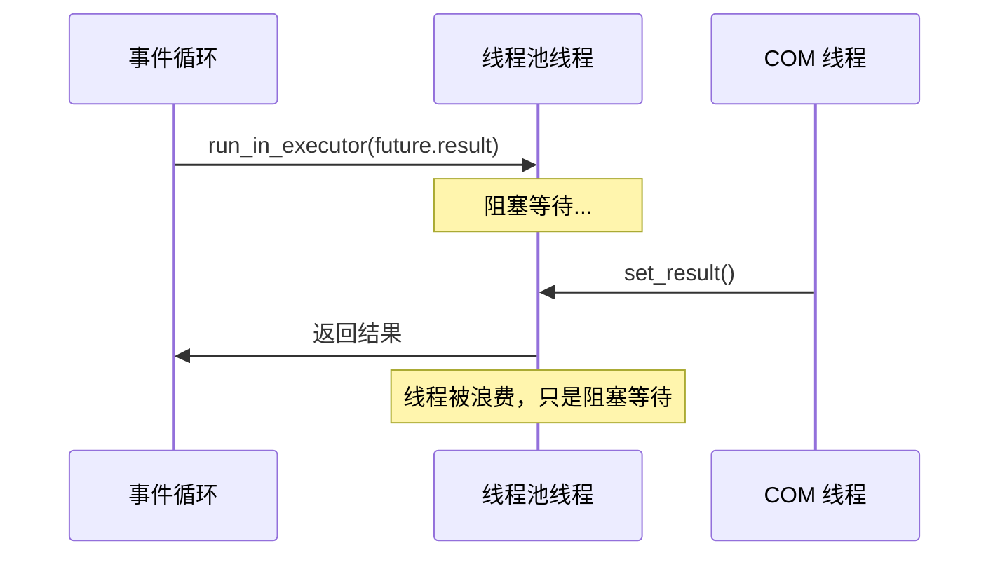
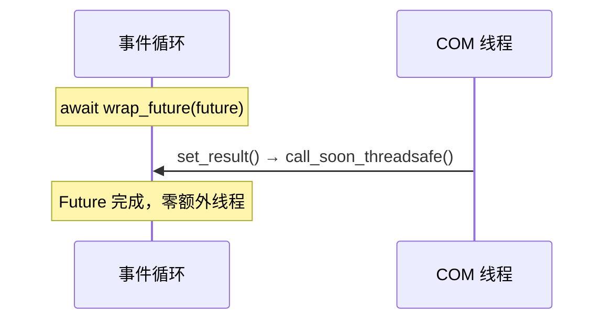
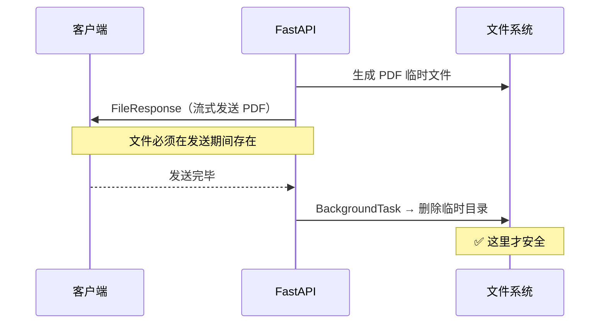
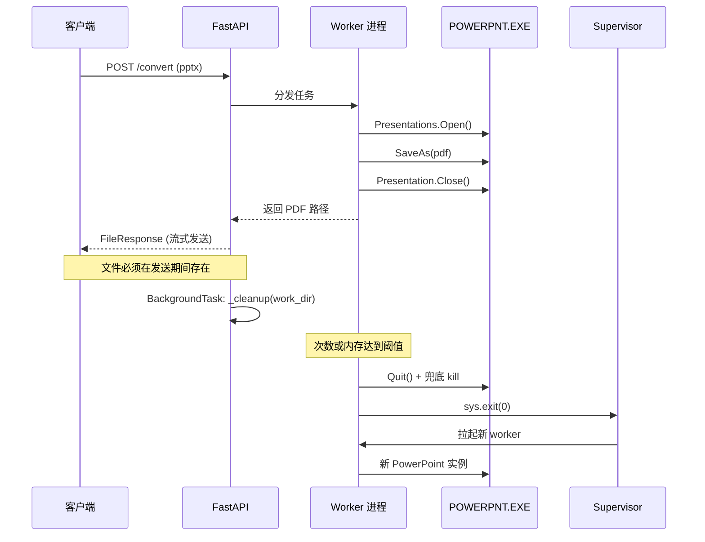
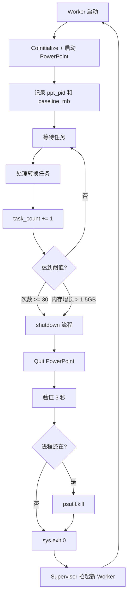
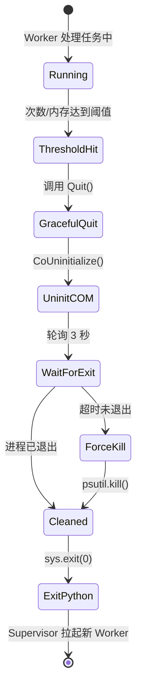
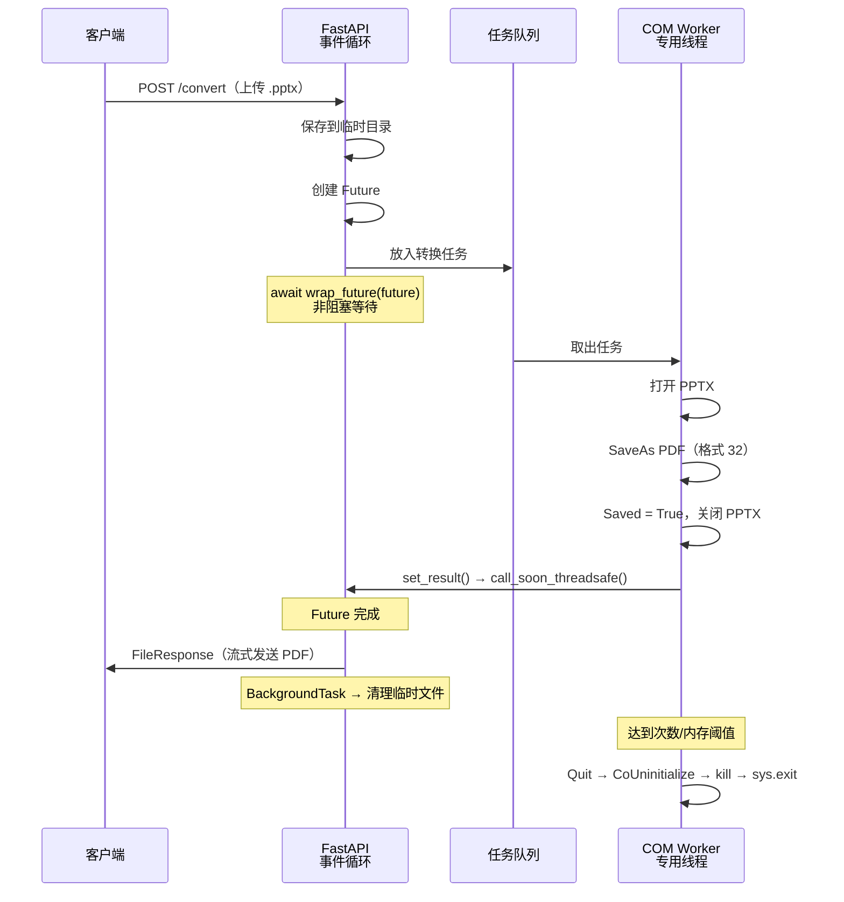

# PPTX to PDF 转换服务 — 技术手册

> 简单就是美。本文档记录核心技术决策、关键知识点和踩坑经验。

---

## 目录

1. [COM 自动化基础](#1-com-自动化基础)
2. [COM 线程安全模型](#2-com-线程安全模型)
3. [FastAPI 线程模型](#3-fastapi-线程模型)
4. [跨线程 Future 桥接](#4-跨线程-future-桥接)
5. [FileResponse 与临时文件生命周期](#5-fileresponse-与临时文件生命周期)
6. [PowerPoint COM 调用注意事项](#6-powerpoint-com-调用注意事项)
7. [Worker 生命周期与 COM 资源管理](#7-worker-生命周期与-com-资源管理)
8. [架构设计决策](#8-架构设计决策)
9. [生产部署 Checklist](#9-生产部署-checklist)
10. [附录：完整数据流](#附录完整数据流)

---

## 1. COM 自动化基础

### 什么是 COM？

COM (Component Object Model) 是 Microsoft 的二进制接口标准，允许不同语言编写的组件相互通信。PowerPoint 通过 COM 暴露了完整的自动化接口，Python 可以通过 `pywin32`（`win32com.client`）来调用。

### Python 中的两个 COM 库

| 库 | 包名 | 特点 |
|---|---|---|
| `win32com.client` | `pywin32` | 标准选择，成熟稳定，基于 `IDispatch` 接口 |
| `comtypes` | `comtypes` | 适合需要访问高级 COM 接口的场景，一般自动化任务中属于"杀鸡用牛刀" |

**本项目选择 `pywin32`**，因为 PowerPoint 自动化只需要 `IDispatch`，不需要更底层的接口。

### 核心转换代码

```python
import win32com.client

powerpoint = win32com.client.Dispatch("PowerPoint.Application")
presentation = powerpoint.Presentations.Open(input_path, WithWindow=False)
presentation.SaveAs(output_path, 32)  # 32 = ppSaveAsPDF
presentation.Close()
powerpoint.Quit()
```

`32` 是 PowerPoint 的 `ppSaveAsPDF` 常量，代表导出为 PDF 格式。

---

## 2. COM 线程安全模型

### 核心问题

> **COM 对象不是线程安全的。**

COM 使用"套间"（Apartment）模型来管理线程安全：

| 模型 | 名称 | 含义 |
|---|---|---|
| STA | Single-Threaded Apartment | 对象只能在创建它的线程中使用 |
| MTA | Multi-Threaded Apartment | 对象可以在任意线程中使用（但仍需同步） |

PowerPoint COM 对象使用 **STA 模型**，这意味着：

1. 每个线程必须调用 `CoInitialize()` 或 `CoInitializeEx()` 来初始化 COM
2. COM 对象**只能在创建它的线程中使用**
3. 跨线程传递 COM 对象会导致 `RPC_E_WRONG_THREAD` 错误或直接崩溃

### 常见错误模式

```python
# ❌ 错误：在主线程创建，在其他线程使用
powerpoint = win32com.client.Dispatch("PowerPoint.Application")

def worker():
    # 这里使用 powerpoint 对象会崩溃！
    presentation = powerpoint.Presentations.Open(...)

threading.Thread(target=worker).start()
```

```python
# ❌ 错误：在 FastAPI 多线程中共享
@app.post("/convert")
def convert(file: UploadFile):
    # FastAPI 的同步端点在线程池中运行
    # 多个请求 = 多个线程同时访问同一个 COM 对象 → 崩溃
    presentation = shared_powerpoint.Presentations.Open(...)
```

### 正确做法：专用线程

```python
# ✅ 正确：所有 COM 操作在同一线程中完成
def com_worker_loop():
    pythoncom.CoInitialize()  # 初始化 COM
    powerpoint = win32com.client.Dispatch("PowerPoint.Application")

    while True:
        task = queue.get()  # 从队列取任务
        # 在同一线程中执行所有 COM 操作
        presentation = powerpoint.Presentations.Open(...)
        presentation.SaveAs(...)
        presentation.Close()

    powerpoint.Quit()
    pythoncom.CoUninitialize()
```

---

## 3. FastAPI 线程模型

### async def vs def

FastAPI 对两种端点定义有完全不同的执行策略：


| 定义方式 | 运行位置 | 适用场景 |
|---------|---------|---------|
| `async def` | asyncio 事件循环（主线程） | I/O 密集型、`await` 异步操作 |
| `def` | 线程池 | CPU 密集型、阻塞 I/O |

### 关键推论

1. **`async def` 端点中不能执行阻塞操作**：因为它直接运行在事件循环上，阻塞 = 阻塞整个服务
2. **`def` 端点是多线程并发的**：多个请求会在不同线程中同时运行，共享状态需要加锁
3. **本项目使用 `async def`**：因为我们通过 `await` 等待 COM 线程完成，完全非阻塞

---

## 4. 跨线程 Future 桥接

### 问题

我们的架构中存在两个世界：

- **asyncio 世界**：FastAPI 端点，运行在事件循环上
- **线程世界**：COM Worker，运行在专用线程中

需要一种机制让 async 端点等待线程中的结果。

### 方案对比

#### ❌ 方案 A：`run_in_executor` + `future.result()`

```python
loop = asyncio.get_event_loop()
await loop.run_in_executor(None, future.result)
```

工作原理：
1. 把 `future.result()`（阻塞调用）扔到线程池
2. 线程池中的一个线程被阻塞等待结果
3. 结果到达后，通过 asyncio 通知事件循环

**缺点**：浪费一个线程池线程，它什么也不做，只是阻塞等待。

#### ✅ 方案 B：`asyncio.wrap_future()`

```python
await asyncio.wrap_future(future)
```

工作原理：
1. `wrap_future` 把 `concurrent.futures.Future` 包装为 `asyncio.Future`
2. 当 COM 线程调用 `future.set_result()` 时，内部自动调用 `loop.call_soon_threadsafe()` 通知事件循环
3. **零线程消耗**，纯事件驱动

#### 方案 A：`run_in_executor`（浪费线程）



#### 方案 B：`wrap_future`（零线程消耗）



### `concurrent.futures.Future` 的线程安全性

`concurrent.futures.Future` **天生就是线程安全的**，它的 `set_result()`、`set_exception()`、`result()` 等方法内部都有锁保护。这是标准库的设计保证，可以放心跨线程使用。

> 注意：`asyncio.Future` 则**不是**线程安全的，它只能在事件循环所在线程中操作。
> `wrap_future` 正是负责在两者之间做安全桥接。

### 带超时的完整模式

```python
await asyncio.wait_for(
    asyncio.wrap_future(future),
    timeout=120,
)
```

`wait_for` 提供超时保护。如果 COM 转换卡死（比如 PowerPoint 弹出对话框），不会让请求无限等待。

---

## 5. FileResponse 与临时文件生命周期

### 问题

转换流程中产生临时文件（上传的 PPTX 和生成的 PDF），需要在响应完成后清理。但清理时机很关键：

```python
# ❌ 错误：文件还没发送完就被删了
try:
    return FileResponse(path=output_path)
finally:
    shutil.rmtree(work_dir)  # FileResponse 是流式的，这里删除太早！
```

`FileResponse` 不是立即读取文件内容的，它是**流式发送**。在 `return` 之后，文件还需要保持存在直到响应发送完毕。

### 解决方案：BackgroundTask

Starlette 的 `BackgroundTask` 在**响应完全发送到客户端之后**才执行：

```python
from starlette.background import BackgroundTask

return FileResponse(
    path=output_path,
    filename=pdf_name,
    media_type="application/pdf",
    background=BackgroundTask(_cleanup, work_dir),  # 发送完毕后才清理
)
```

时序图：



### 错误路径的清理

如果转换失败（超时、异常），`FileResponse` 不会被返回，所以需要在 `except` 块中手动清理：

```python
except asyncio.TimeoutError:
    _cleanup(work_dir)       # 手动清理
    raise HTTPException(...)

except Exception as e:
    _cleanup(work_dir)       # 手动清理
    raise HTTPException(...)
```

---

## 6. PowerPoint COM 调用注意事项

### 必须使用绝对路径

COM 的当前工作目录与 Python 的 `os.getcwd()` **不是同一个东西**。传递相对路径会导致"文件未找到"错误：

```python
# ❌ 相对路径 → COM 找不到文件
presentation = powerpoint.Presentations.Open("temp/input.pptx")

# ✅ 绝对路径
presentation = powerpoint.Presentations.Open(r"C:\temp\input.pptx")
```

本项目在 `ComWorker.convert()` 中自动转换：

```python
task = ConvertTask(
    input_path=os.path.abspath(input_path),
    output_path=os.path.abspath(output_path),
    ...
)
```

### 后台模式运行

```python
powerpoint = win32com.client.Dispatch("PowerPoint.Application")
powerpoint.Visible = False  # 不显示窗口
```

如果不设置 `Visible = False`，PowerPoint 窗口会弹出，在服务器环境中可能导致各种问题。

### 打开文件时的参数

```python
presentation = powerpoint.Presentations.Open(
    input_path,
    ReadOnly=True,      # 只读打开，避免锁定文件
    Untitled=False,     # 不作为"无标题"文档
    WithWindow=False,   # 不创建窗口（进一步减少 GUI 交互）
)
```

### Close 前设置 Saved = True

即使只是 `SaveAs`，PowerPoint 也可能把文档标记为"已修改"。`Close()` 时会弹框问"是否保存"——服务端没人点击，进程就僵死。

```python
presentation = None
try:
    presentation = powerpoint.Presentations.Open(...)
    presentation.SaveAs(output_path, 32)
finally:
    if presentation:
        presentation.Saved = True   # 关键：防止 Close 时弹"是否保存"
        presentation.Close()
```

### PowerPoint 弹框问题

在某些情况下（文件损坏、宏安全提示等），PowerPoint 可能会弹出对话框，导致自动化卡住。缓解措施：

1. **超时保护**：`asyncio.wait_for(..., timeout=120)` 确保不会无限等待
2. **后台运行**：`Visible = False` + `WithWindow = False` 减少 GUI 交互
3. **只读打开**：`ReadOnly = True` 避免"是否保存"提示

---

## 7. Worker 生命周期与 COM 资源管理

### 7.1 为什么需要定期回收 Worker

`pywin32` + PowerPoint 组合长时间运行必然出现以下问题：

- **内存泄漏**：`Presentation.Close()` 不会真正释放所有资源，PowerPoint 内部会缓存最近文档列表、字体句柄、临时 OLE 对象、undo 历史、COM 代理等，累积不回收。
- **性能衰减**：跑几百次后单次转换时间从 2 秒涨到 10 秒以上。
- **隐式弹框残留**：某些文件会触发 PowerPoint 弹框（宏安全、字体缺失、恢复提示），无人响应后残留在后台。
- **COM 代理损坏**：一次异常可能让后续所有调用都失败。

**结论**：不要与 COM 斗智斗勇，**定期杀进程是最划算的策略**。

### 7.2 整体架构时序图



### 7.3 COM 污染：Python 进程侧的风险

PowerPoint 进程泄漏是直观的，但 **Python 进程本身也会被 COM 污染**，这点容易被忽视。

**COM 代理对象引用泄漏。** `pywin32` 每个 COM 对象（`powerpoint`、`presentation`、`slides`、`shapes[0]`……）在 Python 侧都是代理对象，内部持有对 PowerPoint 真实对象的引用。没显式释放就靠 GC，而 GC 时机不确定，循环引用场景下可能永远不触发。

**STA 线程套间污染。** `CoInitialize()` 把当前线程注册成单线程套间（STA），不 `CoUninitialize()` 就一直在。这个状态是线程级的，会和某些异步库的事件循环、消息泵打架。

**异常栈的隐式引用（最阴险）：**

```python
try:
    presentation = powerpoint.Presentations.Open(bad_file)
    presentation.SaveAs(...)
except Exception:
    logger.error("failed", exc_info=True)   # ← 坑在这
```

`exc_info=True` 把整个 traceback 存下来，traceback 里的局部变量包含 `presentation` 代理。Python 默认会把最后一个异常挂在 `sys.last_traceback` 上——**那个失败的 Presentation 代理永远不释放**，PowerPoint 那边的文档对象也永远不释放，下次 Quit 直接卡死。

**应对措施（代码层面）：**

```python
import pythoncom, gc

try:
    presentation = powerpoint.Presentations.Open(...)
    presentation.SaveAs(...)
finally:
    if presentation is not None:
        try:
            presentation.Saved = True
            presentation.Close()
        except Exception:
            pass
    presentation = None              # 显式解引用
    gc.collect()                     # 强制 GC，让代理立即释放
    pythoncom.PumpWaitingMessages()  # 清空 COM 消息队列
```

**架构层面（更有效）：** 定期重启整个 Python 进程。无论 COM 代理泄漏多少、traceback 挂了多少僵尸引用——**进程一死全部清零**。

### 7.4 Worker 自裁 + Supervisor 拉起

让 worker 自己判断"阈值到了"主动退出，Supervisor 负责拉起新实例。比依赖 Celery `max_tasks_per_child` 更灵活——可以做**次数 OR 内存**双条件触发。



**阈值设置**（双阈值任一触发即退）：

| 参数 | 建议值 | 说明 |
| --- | --- | --- |
| 任务次数上限 | 30 - 50 | 保守起步，稳定后再调 |
| 内存增长上限 | 1.5 GB | 相对 baseline 的增长量，不是绝对值 |
| 单任务超时 | 120 秒 | 超时通常意味着 COM 已不可信 |

> 为什么是"内存增长"而不是"当前内存"：PowerPoint 刚启动约 80-150 MB，打开大 pptx 会瞬间飙到 1-2 GB 很正常。判断是否泄漏看的是"相对基线涨了多少"。

### 7.5 内存监控：获取 PowerPoint 内存占用

**同机场景（最常见）**

Python 进程与 `POWERPNT.EXE` 在同一台 Windows 上，直接用 `psutil`：

```python
import psutil, win32process

class Worker:
    def _start_powerpoint(self):
        self.powerpoint = win32com.client.DispatchEx("PowerPoint.Application")
        # 启动后立即抓 PID 存起来（Quit 后就拿不到了）
        hwnd = self.powerpoint.HWND
        _, self.ppt_pid = win32process.GetWindowThreadProcessId(hwnd)
        self.baseline_mb = self._ppt_memory_mb()

    def _ppt_memory_mb(self):
        try:
            return psutil.Process(self.ppt_pid).memory_info().rss / 1024 / 1024
        except psutil.NoSuchProcess:
            return 0

    def _should_exit(self):
        if self.task_count >= self.MAX_TASKS:
            return True
        growth = self._ppt_memory_mb() - self.baseline_mb
        return growth > self.MAX_MEMORY_GROWTH_MB
```

关键点：记录**自己启动的那个 PID**，多 worker 场景下避免互相看错。用 `rss`（实际物理内存），不要用 `vms`（Windows 上无参考价值）。

**跨机场景**

Linux 服务器调用远程 Windows 的 PowerPoint（DCOM 或 HTTP agent 模式）：

- **自建 agent**：Windows 上跑小 FastAPI 暴露 `/metrics` 端点，返回 PowerPoint 内存数据。
- **windows_exporter + Prometheus**：已有监控体系时首选，按进程名过滤 `POWERPNT.EXE`。

### 7.6 退出流程：Quit → 验证 → 兜底 Kill

**为什么 `Quit()` 不可信**

`Quit()` 会在以下情况**静默失败**（Python 侧看起来成功返回，但 `POWERPNT.EXE` 继续在后台）：

- 弹框拦截（文件损坏恢复、宏安全警告、字体缺失）
- COM 代理已损坏（上次异常留下的后遗症）
- 还有未释放的 Presentation 引用
- Quit 本身抛异常被吞掉

结果：任务管理器里堆几十个 `POWERPNT.EXE`，每个吃几百 MB，直到服务器 OOM。

**完整退出流程**

```python
import sys, os, time, psutil, pythoncom, logging

logger = logging.getLogger(__name__)

def shutdown_and_exit(powerpoint, ppt_pid):
    """Worker 退出前的完整清理。顺序严格，不要调整。"""

    # ===== Step 1: 尝试优雅 Quit =====
    try:
        powerpoint.Quit()
        logger.info("PowerPoint.Quit() called")
    except Exception as e:
        logger.warning(f"Quit raised exception (expected, continuing): {e}")

    # 释放 Python 侧的 COM 代理
    powerpoint = None

    # ===== Step 2: 释放当前线程的 COM =====
    try:
        pythoncom.CoUninitialize()
    except Exception as e:
        logger.warning(f"CoUninitialize exception: {e}")

    # ===== Step 3: 轮询 3 秒，给 Quit 机会 =====
    deadline = time.time() + 3
    while time.time() < deadline:
        if not _is_process_alive(ppt_pid):
            logger.info(f"PowerPoint (pid={ppt_pid}) exited cleanly")
            break
        time.sleep(0.1)

    # ===== Step 4: 还活着？强杀 =====
    if _is_process_alive(ppt_pid):
        logger.warning(f"PowerPoint (pid={ppt_pid}) did not respond to Quit, force killing")
        _force_kill(ppt_pid)

    # ===== Step 5: 退出 Python =====
    logger.info("Worker exiting, Supervisor will restart")
    sys.exit(0)


def _is_process_alive(pid):
    try:
        p = psutil.Process(pid)
        return p.is_running() and p.status() != psutil.STATUS_ZOMBIE
    except psutil.NoSuchProcess:
        return False


def _force_kill(pid):
    try:
        p = psutil.Process(pid)
        p.kill()
        p.wait(timeout=5)
    except psutil.NoSuchProcess:
        pass
    except psutil.TimeoutExpired:
        logger.error(f"pid={pid} still alive after kill")
```

**退出流程状态图**



**每一步的关键理由**

| 步骤 | 为什么这么做 |
| --- | --- |
| Quit 要 try 住 | `Quit()` 最容易抛 COM 异常，但异常不代表失败，后面有兜底 |
| CoUninitialize 在 Quit 之后 | 反了 Python 侧 COM 通道已关，Quit 调用发不出去 |
| 轮询 3 秒不用 sleep | Quit 快则 100ms 慢则 3s，轮询早走早开始下一个 worker |
| kill 前必须提前记 PID | Quit 后 `powerpoint` 对象不可用，拿不到 PID |
| 先 PowerPoint 再 Python | `os._exit(0)` 不跑 finally，顺序反了会留僵尸 |

**`sys.exit` vs `os._exit`**

| 场景 | 用哪个 |
| --- | --- |
| 正常场景 | `sys.exit(0)`，会触发 atexit、flush 日志、关文件句柄 |
| 被框架拦截卡住退不出 | `os._exit(0)`，立即退出跳过所有 cleanup（**前提：PowerPoint 已清理干净**） |

### 7.7 Supervisor 配置

```ini
[program:ppt_worker]
command=python worker.py
autorestart=true
exitcodes=0,1        ; 0 和 1 都算预期退出，都重启
startsecs=5          ; 启动 5 秒内没死才算成功
startretries=3       ; 连续起不来 3 次就放弃（防死循环）
stopwaitsecs=30      ; 给 30 秒时间清理 PowerPoint
```

`startretries=3` 很关键——如果 PowerPoint 安装坏了，worker 起来就崩，没这个限制 Supervisor 会无限重启把 CPU 打满。

### 7.8 多 Worker 错峰重启

单 worker 重启期间（3-5 秒）服务不可用。**线上至少跑 2 个 worker**，并错峰重启：

```python
# 简单做法：不同 worker 配不同阈值，天然错开
MAX_TASKS = 30 if worker_id == "A" else 45
```

---

## 8. 架构设计决策

### 为什么选择单文件架构？

```
pptx_to_pdf/
├── main.py             # 所有逻辑
├── pyproject.toml      # 依赖
├── test.sh             # 测试
└── readme.md           # 文档
```

本服务功能单一（上传 PPTX → 返回 PDF），代码量约 300 行。拆分成多个模块反而增加了认知负担，不符合"简单就是美"的原则。

### 为什么复用 PowerPoint 实例？

| 策略 | 启动耗时 | 内存 | 稳定性 |
|------|---------|------|--------|
| 每次请求创建/销毁 | 高（2-5 秒启动） | 波动大 | 低（可能残留进程） |
| **复用单实例** | **首次启动后零开销** | **稳定** | **高** |
| 多实例池 | 高初始成本 | 高 | 中等（需要复杂管理） |

复用单实例是性能和复杂度的最佳平衡点。

### 为什么使用队列串行处理？

PowerPoint 即使在同一线程中，同时打开多个文件进行 `SaveAs` 也可能出现不稳定行为。串行处理：

- **可靠**：一次只做一件事
- **简单**：不需要信号量、锁或池管理
- **可预测**：每个请求的资源消耗恒定

如果需要更高吞吐量，可以启动多个服务实例（进程级并行），每个进程有独立的 PowerPoint 实例。

### 为什么用 `uv` 管理环境？

| 特性 | pip + venv | uv |
|------|-----------|-----|
| 依赖解析速度 | 慢 | 极快（Rust 实现） |
| 锁文件 | 无原生支持 | `uv.lock` 自动生成 |
| 环境管理 | 手动 `python -m venv` | `uv sync` 一步完成 |
| 可复现性 | 依赖 `requirements.txt` 手动维护 | 锁文件保证精确复现 |

---

## 9. 生产部署 Checklist

- [ ] 记录 `ppt_pid` 和 `baseline_mb` 在 PowerPoint 启动后立即进行
- [ ] 每次转换在 `finally` 里 `presentation.Saved = True` + `Close()`
- [ ] 阈值判断只在任务间隙做，不要在任务中间中断
- [ ] Shutdown 流程严格按照 Quit → CoUninitialize → 轮询 → kill → exit 顺序
- [ ] Supervisor 配 `autorestart=true` + `startretries=3` + `stopwaitsecs=30`
- [ ] 线上至少 2 个 worker，错峰重启（配不同阈值天然错开）
- [ ] 服务启动时清理遗留的 `POWERPNT.EXE`（单 worker 场景）
- [ ] 单任务超时（120s）触发时，整个 worker 也退出（COM 已不可信）
- [ ] 日志里打 PID、task_count、memory_mb，方便排查
- [ ] 避免 `logger.exception` / `exc_info=True` 长期持有失败 presentation 引用

---

## 附录：完整数据流



---

## 关键经验总结

1. **别跟 COM 斗智斗勇，定期杀进程最划算。** 一百行清理代码不如一次进程重启。
2. **Quit 不可信。** 始终配合 psutil 验证 + 兜底 kill。
3. **PID 要提前记。** Quit 之后拿不到了。
4. **"内存增长"比"当前内存"更科学。** 大文件转换时的短时飙升是正常的。
5. **至少 2 个 worker + 错峰重启。** 单 worker 重启期间服务不可用。
6. **`exc_info=True` 是隐形炸弹。** 异常栈持有 COM 代理，导致 Quit 卡死。
7. **Windows Server 跑 PowerPoint 自动化是微软不推荐的做法。** 生产环境可考虑 LibreOffice headless 或 `unoconv` 替代。
