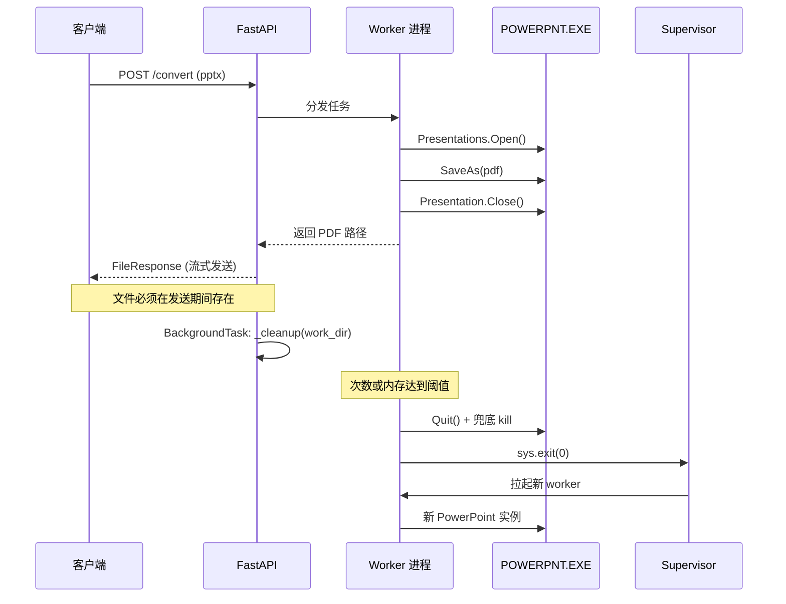
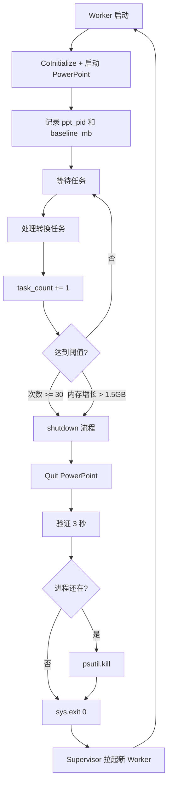
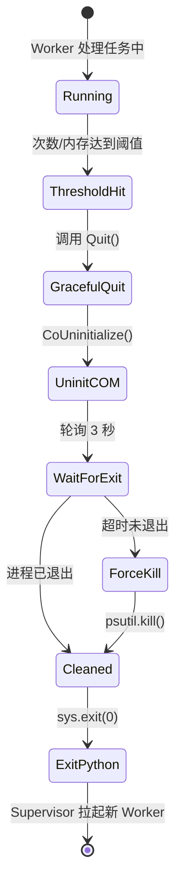

# PPT 转 PDF 服务：Worker 生命周期与 COM 资源管理

> 针对基于 FastAPI + pywin32 调用 PowerPoint 进行 PPT 转 PDF 的服务端场景，梳理 COM 资源管理、worker 定期回收、优雅退出等关键技术问题。

---

## 1. 背景：为什么需要 Worker 定期回收

### 1.1 COM 调用链

```python
return FileResponse(
    path=output_path,
    filename=pdf_name,
    media_type="application/pdf",
    background=BackgroundTask(_cleanup, work_dir),
)
```

FastAPI 的 `BackgroundTask` 在响应返回**之后**才执行 `_cleanup`，这个机制很适合做"发送期间文件必须存在，发送完成后再清理"的轻量收尾。但对于 PowerPoint 这种重量级 COM 资源，仅靠 `BackgroundTask` 做进程级回收是不够的。

### 1.2 PowerPoint COM 的长跑陷阱

`pywin32` + PowerPoint 组合长时间运行必然出现以下问题：

- **内存泄漏**：`Presentation.Close()` 不会真正释放所有资源，PowerPoint 内部会缓存最近文档列表、字体句柄、临时 OLE 对象、undo 历史、COM 代理等，累积不回收。
- **性能衰减**：跑几百次后单次转换时间从 2 秒涨到 10 秒以上。
- **隐式弹框残留**：某些文件会触发 PowerPoint 弹框（宏安全、字体缺失、恢复提示），无人响应后残留在后台。
- **COM 代理损坏**：一次异常可能让后续所有调用都失败。

**结论**：不要与 COM 斗智斗勇，**定期杀进程是最划算的策略**。

### 1.3 整体架构时序图



---

## 2. Close vs Quit：层级区分

两个 API 作用层级完全不同，必须分清：

| API                    | 作用对象             | 类比          | 使用时机       |
| ---------------------- | -------------------- | ------------- | -------------- |
| `Presentation.Close()` | 单个文档             | Ctrl+W 关文件 | 每次转换完成后 |
| `Application.Quit()`   | 整个 PowerPoint 程序 | Alt+F4 退程序 | Worker 退出前  |

### 2.1 正确嵌套关系

```python
# 每个转换请求：
presentation = powerpoint.Presentations.Open(pptx_path, ReadOnly=True)
try:
    presentation.SaveAs(pdf_path, FileFormat=32)  # 32 = PDF
finally:
    if presentation is not None:
        presentation.Saved = True   # 关键：防止 Close 时弹"是否保存"
        presentation.Close()

# Worker 退出时：
powerpoint.Quit()
```

### 2.2 `Saved = True` 的必要性

即使只是 `SaveAs`，PowerPoint 也可能把文档标记为"已修改"。`Close()` 时会弹框问"是否保存"——服务端没人点击，进程就僵死。

**强制告诉 PowerPoint"已经存过了，别问"**，是避免弹框的最简单办法。

---

## 3. COM 污染：Python 进程侧的风险

PowerPoint 进程泄漏是直观的，但 **Python 进程本身也会被 COM 污染**，这点容易被忽视。

### 3.1 污染来源

**COM 代理对象引用泄漏。** `pywin32` 每个 COM 对象（`powerpoint`、`presentation`、`slides`、`shapes[0]`……）在 Python 侧都是代理对象，内部持有对 PowerPoint 真实对象的引用。没显式释放就靠 GC，而 GC 时机不确定，循环引用场景下可能永远不触发。

**STA 线程套间污染。** `CoInitialize()` 把当前线程注册成单线程套间（STA），不 `CoUninitialize()` 就一直在。这个状态是线程级的，会和某些异步库的事件循环、消息泵打架。

**异常栈的隐式引用（最阴险）：**

```python
try:
    presentation = powerpoint.Presentations.Open(bad_file)
    presentation.SaveAs(...)
except Exception:
    logger.error("failed", exc_info=True)   # ← 坑在这
```

`exc_info=True` 把整个 traceback 存下来，traceback 里的局部变量包含 `presentation` 代理。Python 默认会把最后一个异常挂在 `sys.last_traceback` 上——**那个失败的 Presentation 代理永远不释放**，PowerPoint 那边的文档对象也永远不释放，下次 Quit 直接卡死。

### 3.2 应对措施

**代码层面：**

```python
import pythoncom, gc

try:
    presentation = powerpoint.Presentations.Open(...)
    presentation.SaveAs(...)
finally:
    if presentation is not None:
        try:
            presentation.Saved = True
            presentation.Close()
        except Exception:
            pass
    presentation = None              # 显式解引用
    gc.collect()                     # 强制 GC，让代理立即释放
    pythoncom.PumpWaitingMessages()  # 清空 COM 消息队列
```

**架构层面（更有效）：** 定期重启整个 Python 进程。无论 COM 代理泄漏多少、traceback 挂了多少僵尸引用——**进程一死全部清零**。

---

## 4. Worker 自裁 + Supervisor 拉起

### 4.1 核心思路

让 worker 自己判断"阈值到了"主动退出，Supervisor 负责拉起新实例。比依赖 Celery `max_tasks_per_child` 更灵活——可以做**次数 OR 内存**双条件触发。



### 4.2 阈值设置

经验值（**双阈值任一触发即退**）：

| 参数         | 建议值  | 说明                               |
| ------------ | ------- | ---------------------------------- |
| 任务次数上限 | 30 - 50 | 保守起步，稳定后再调               |
| 内存增长上限 | 1.5 GB  | 相对 baseline 的增长量，不是绝对值 |
| 单任务超时   | 120 秒  | 超时通常意味着 COM 已不可信        |

**为什么是"内存增长"而不是"当前内存"：** PowerPoint 刚启动约 80-150 MB，打开大 pptx 会瞬间飙到 1-2 GB 很正常。判断是否泄漏看的是"相对基线涨了多少"。

### 4.3 Supervisor 配置

```ini
[program:ppt_worker]
command=python worker.py
autorestart=true
exitcodes=0,1        ; 0 和 1 都算预期退出，都重启
startsecs=5          ; 启动 5 秒内没死才算成功
startretries=3       ; 连续起不来 3 次就放弃（防死循环）
stopwaitsecs=30      ; 给 30 秒时间清理 PowerPoint
```

`startretries=3` 很关键——如果 PowerPoint 安装坏了，worker 起来就崩，没这个限制 Supervisor 会无限重启把 CPU 打满。

### 4.4 多 Worker 错峰重启

单 worker 重启期间（3-5 秒）服务不可用。**线上至少跑 2 个 worker**，并错峰重启：

```python
# 简单做法：不同 worker 配不同阈值，天然错开
MAX_TASKS = 30 if worker_id == "A" else 45
```

---

## 5. 内存监控：如何获取 PowerPoint 内存占用

### 5.1 同机场景（最常见）

Python 进程与 `POWERPNT.EXE` 在同一台 Windows 上，直接用 `psutil`：

```python
import psutil, win32process

class Worker:
    def _start_powerpoint(self):
        self.powerpoint = win32com.client.DispatchEx("PowerPoint.Application")
        # 启动后立即抓 PID 存起来（Quit 后就拿不到了）
        hwnd = self.powerpoint.HWND
        _, self.ppt_pid = win32process.GetWindowThreadProcessId(hwnd)
        self.baseline_mb = self._ppt_memory_mb()

    def _ppt_memory_mb(self):
        try:
            return psutil.Process(self.ppt_pid).memory_info().rss / 1024 / 1024
        except psutil.NoSuchProcess:
            return 0

    def _should_exit(self):
        if self.task_count >= self.MAX_TASKS:
            return True
        growth = self._ppt_memory_mb() - self.baseline_mb
        return growth > self.MAX_MEMORY_GROWTH_MB
```

**关键点：** 记录**自己启动的那个 PID**，多 worker 场景下避免互相看错。用 `rss`（实际物理内存），不要用 `vms`（Windows 上无参考价值）。

### 5.2 跨机场景

Linux 服务器调用远程 Windows 的 PowerPoint（DCOM 或 HTTP agent 模式），推荐：

- **自建 agent**：Windows 上跑小 FastAPI 暴露 `/metrics` 端点，返回 PowerPoint 内存数据。
- **windows_exporter + Prometheus**：已有监控体系时首选，按进程名过滤 `POWERPNT.EXE`。

---

## 6. 退出流程：Quit → 验证 → 兜底 Kill

### 6.1 为什么 `Quit()` 不可信

`Quit()` 会在以下情况**静默失败**（Python 侧看起来成功返回，但 `POWERPNT.EXE` 继续在后台）：

- 弹框拦截（文件损坏恢复、宏安全警告、字体缺失）
- COM 代理已损坏（上次异常留下的后遗症）
- 还有未释放的 Presentation 引用
- Quit 本身抛异常被吞掉

**结果：** 任务管理器里堆几十个 `POWERPNT.EXE`，每个吃几百 MB，直到服务器 OOM。

### 6.2 完整退出流程

```python
import sys, os, time, psutil, pythoncom, logging

logger = logging.getLogger(__name__)

def shutdown_and_exit(powerpoint, ppt_pid):
    """Worker 退出前的完整清理。顺序严格，不要调整。"""

    # ========== 第 1 步：尝试优雅 Quit ==========
    try:
        powerpoint.Quit()
        logger.info("PowerPoint.Quit() 已调用")
    except Exception as e:
        logger.warning(f"Quit 抛异常（正常，继续）: {e}")

    # 释放 Python 侧的 COM 代理
    powerpoint = None

    # ========== 第 2 步：释放当前线程的 COM ==========
    try:
        pythoncom.CoUninitialize()
    except Exception as e:
        logger.warning(f"CoUninitialize 异常: {e}")

    # ========== 第 3 步：轮询 3 秒，给 Quit 机会 ==========
    deadline = time.time() + 3
    while time.time() < deadline:
        if not _is_process_alive(ppt_pid):
            logger.info(f"PowerPoint (pid={ppt_pid}) 已干净退出")
            break
        time.sleep(0.1)

    # ========== 第 4 步：还活着？强杀 ==========
    if _is_process_alive(ppt_pid):
        logger.warning(f"PowerPoint (pid={ppt_pid}) 未响应 Quit，强杀")
        _force_kill(ppt_pid)

    # ========== 第 5 步：退出 Python ==========
    logger.info("Worker 退出，交给 Supervisor")
    sys.exit(0)


def _is_process_alive(pid):
    try:
        p = psutil.Process(pid)
        return p.is_running() and p.status() != psutil.STATUS_ZOMBIE
    except psutil.NoSuchProcess:
        return False


def _force_kill(pid):
    try:
        p = psutil.Process(pid)
        p.kill()
        p.wait(timeout=5)
    except psutil.NoSuchProcess:
        pass
    except psutil.TimeoutExpired:
        logger.error(f"pid={pid} kill 后仍未退出")
```

### 6.3 退出流程状态图



### 6.4 每一步的关键理由

| 步骤                        | 为什么这么做                                             |
| --------------------------- | -------------------------------------------------------- |
| Quit 要 try 住              | `Quit()` 最容易抛 COM 异常，但异常不代表失败，后面有兜底 |
| CoUninitialize 在 Quit 之后 | 反了 Python 侧 COM 通道已关，Quit 调用发不出去           |
| 轮询 3 秒不用 sleep         | Quit 快则 100ms 慢则 3s，轮询早走早开始下一个 worker     |
| kill 前必须提前记 PID       | Quit 后 `powerpoint` 对象不可用，拿不到 PID              |
| 先 PowerPoint 再 Python     | `os._exit(0)` 不跑 finally，顺序反了会留僵尸             |

### 6.5 `sys.exit` vs `os._exit`

| 场景                 | 用哪个                                                                     |
| -------------------- | -------------------------------------------------------------------------- |
| 正常场景             | `sys.exit(0)`，会触发 atexit、flush 日志、关文件句柄                       |
| 被框架拦截卡住退不出 | `os._exit(0)`，立即退出跳过所有 cleanup（**前提：PowerPoint 已清理干净**） |

---

## 7. 生产部署 Checklist

- [ ] 记录 `ppt_pid` 和 `baseline_mb` 在 PowerPoint 启动后立即进行
- [ ] 每次转换在 `finally` 里 `presentation.Saved = True` + `Close()`
- [ ] 阈值判断只在任务间隙做，不要在任务中间中断
- [ ] Shutdown 流程严格按照 Quit → CoUninitialize → 轮询 → kill → exit 顺序
- [ ] Supervisor 配 `autorestart=true` + `startretries=3` + `stopwaitsecs=30`
- [ ] 线上至少 2 个 worker，错峰重启（配不同阈值天然错开）
- [ ] 服务启动时清理遗留的 `POWERPNT.EXE`（单 worker 场景）
- [ ] 单任务超时（120s）触发时，整个 worker 也退出（COM 已不可信）
- [ ] 日志里打 PID、task_count、memory_mb，方便排查
- [ ] 避免 `logger.exception` / `exc_info=True` 长期持有失败 presentation 引用

---

## 8. 关键经验总结

1. **别跟 COM 斗智斗勇，定期杀进程最划算。** 一百行清理代码不如一次进程重启。
2. **Quit 不可信。** 始终配合 psutil 验证 + 兜底 kill。
3. **PID 要提前记。** Quit 之后拿不到了。
4. **"内存增长"比"当前内存"更科学。** 大文件转换时的短时飙升是正常的。
5. **至少 2 个 worker + 错峰重启。** 单 worker 重启期间服务不可用。
6. **Windows Server 跑 PowerPoint 自动化是微软不推荐的做法。** 生产环境可考虑 LibreOffice headless 或 `unoconv` 替代。
